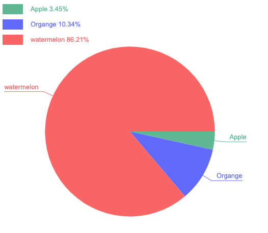

## crude-charts

一个简陋(单)的图表组件，提供了基础的数据展示，动画，和基础的配置项。

学习自：

项目：https://github.com/sutianbinde/charts

博客：https://www.cnblogs.com/chengduxiaoc/category/1094155.html


支持以下组件
- 柱状图
- 饼图
- 折线图

## 快速上手
```javascript
// 以饼图为例
import {Pie} from 'curde-charts';

const charts = new Pie({
  cHeight: 200,
  cWidth: 500,
  data: [
    {
      color: '#60b794',
      value: 10,
      text: '苹果'
    },
    {
      color: '#616afb',
      value: 30,
      text: '梨子'
    },
    {
      color: 'black',
      value: 250,
      text: '西瓜'
    }
  ]
});
```

## 文档

### 通用属性 (Common properties)

> 长，宽，高等属性，单位均为 px

| 属性名                    | 默认值 | 备注                   |
| ------------------------- | ------ | ---------------------- |
| canvasId  `string`        | canvas | canvas 容器            |
| cHeight  `number`         | 必须   | canvas 容器的高度      |
| cWidth  `number`          | 必须   | canvas 容器的宽度      |
| cPadding `number`         | 10     | canvas 容器的内边距    |
| cBackgroundColor `string` | \#fff  | canvas 容器的背景色    |
| animDuration `number`     | 1000   | 动画执行时间，单位毫秒 |
| data `any`                | 必须   | 详见具体组件           |


### 饼图

| 属性名                    | 默认值 | 备注                   |
| ------------------------- | ------ | ---------------------- |
| tagX  `number`        | 0 | 标签起始位置 X            |
| tagY  `number`         | 0   | 标签起始位置 Y       |
| tagW  `number`          | 60   | 标签宽度      |
| tagH `number`         | 20     | 标签高度    |
| tagFont `string` |   | 标签文本样式    |
| pieRadius `number`                | canvas 容器的高度 1/3    | 饼图半径v          |
| pieX  `number`        | canvas 容器的宽度 1/2 | 饼图圆心 X            |
| pieY  `number`         |  canvas 容器的高度 1/2  | 饼图圆心 Y      |
| tipLine  `number`          | 10   | 饼图的边到转折点的距离      |
| tipLineW `number`         | 1     | 横线的宽度    |
| tipFont `string` |   | 横线文字样式    |
| tipPadding `number`     | 10   | 横线文字距离转折点的距离 |
| toFix `number`                | 2   | 百分比的位数           |
| isShowTag `boolean`                | true   | 是否展示 tag           |

## 图例

| 饼图                                                         |
| ------------------------------------------------------------ |
|  |


